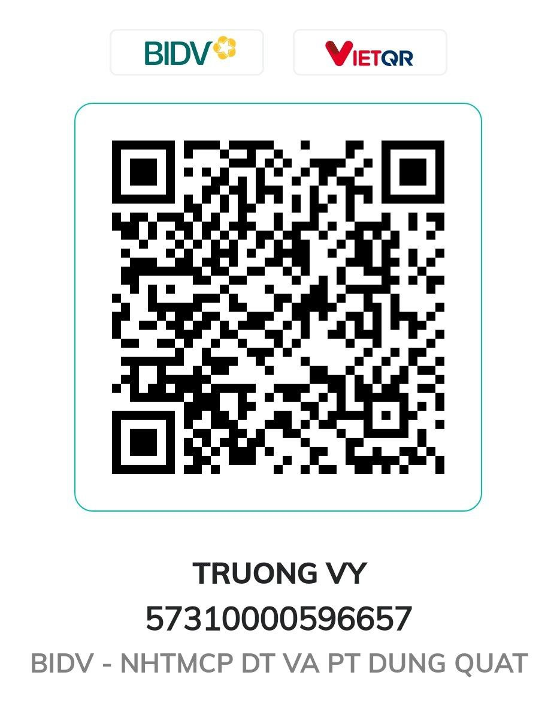

    <article class="markdown-body entry-content container-lg" itemprop="text"><h1 dir="auto"><a id="user-content-hi-world" class="anchor" aria-hidden="true" href="#hi-world"><svg class="octicon octicon-link" viewBox="0 0 16 16" version="1.1" width="16" height="16" aria-hidden="true"><path fill-rule="evenodd" d="M7.775 3.275a.75.75 0 001.06 1.06l1.25-1.25a2 2 0 112.83 2.83l-2.5 2.5a2 2 0 01-2.83 0 .75.75 0 00-1.06 1.06 3.5 3.5 0 004.95 0l2.5-2.5a3.5 3.5 0 00-4.95-4.95l-1.25 1.25zm-4.69 9.64a2 2 0 010-2.83l2.5-2.5a2 2 0 012.83 0 .75.75 0 001.06-1.06 3.5 3.5 0 00-4.95 0l-2.5 2.5a3.5 3.5 0 004.95 4.95l1.25-1.25a.75.75 0 00-1.06-1.06l-1.25 1.25a2 2 0 01-2.83 0z"></path></svg></a>Hi World</h1>

My name is <a href="https://github.com/truongvy-06">Vỹ</a>

<h4 dir="auto"><a id="user-content-want-to-buy-me-a-coffee-" class="anchor" aria-hidden="true" href="#want-to-buy-me-a-coffee-"><svg class="octicon octicon-link" viewBox="0 0 16 16" version="1.1" width="16" height="16" aria-hidden="true"><path fill-rule="evenodd" d="M7.775 3.275a.75.75 0 001.06 1.06l1.25-1.25a2 2 0 112.83 2.83l-2.5 2.5a2 2 0 01-2.83 0 .75.75 0 00-1.06 1.06 3.5 3.5 0 004.95 0l2.5-2.5a3.5 3.5 0 00-4.95-4.95l-1.25 1.25zm-4.69 9.64a2 2 0 010-2.83l2.5-2.5a2 2 0 012.83 0 .75.75 0 001.06-1.06 3.5 3.5 0 00-4.95 0l-2.5 2.5a3.5 3.5 0 004.95 4.95l1.25-1.25a.75.75 0 00-1.06-1.06l-1.25 1.25a2 2 0 01-2.83 0z"></path></svg></a>Want to buy me a coffee <g-emoji class="g-emoji" alias="coffee" fallback-src="https://github.githubassets.com/images/icons/emoji/unicode/2615.png">☕</g-emoji></h4>
<ul dir="auto">
<li>

You can donate by <strong>transfer money</strong> to my e-wallet/bank account below.

</li>
<li>

You can <strong>scan QR Code</strong> to make donation progress faster.

</li>
<li>

Or contact me: <a href="https://www.facebook.com/vyx.006" rel="nofollow">Facebook</a>

</li>
</ul>

<em>Tiếng việt:</em> <g-emoji class="g-emoji" alias="two_hearts" fallback-src="https://github.githubassets.com/images/icons/emoji/unicode/1f495.png">💕</g-emoji>

<ul dir="auto">
<li>Donate bằng cách <strong>chuyển tiền</strong> tới các tài khoản của mình bên dưới.</li>
<li>Bạn có thể <strong>quét mã QR</strong> ở cột QR Code để nhập thông tin nhanh hơn.</li>
<li>Hoặc liên hệ trực tiếp với mình: <a href="https://www.facebook.com/vyx.006" rel="nofollow">Facebook</a></li>
</ul>
<table>
<thead>
<tr>
<th align="center">Provider</th>
<th align="center">ID</th>
<th align="right">Name</th>
<th align="center">QR Code</th>
</tr>
</thead>
<tbody>
<tr>

<td align="center"><a href="https://momo.vn/" rel="nofollow"> 
Momo
</a></td>
<td align="center"><code>0918327827</code></td>
<td align="right">TRUONG VY</td>
<td align="center">

Click to open

</td>
</tr>
<tr>
<td align="center"><a href="https://zalopay.vn/" rel="nofollow">
ZaloPay
</a></td>
<td align="center"><code>0918327827</code></td>
<td align="right">TRUONG VY</td>
<td align="center">

Click to open

</td>
</tr>
<tr>
<td align="center"><a href="https://www.mbbank.com.vn" rel="nofollow">
MB Bank
</a></td>
<td align="center"><code>9999999070600</code></td>
<td align="right">TRUONG VY</td>
<td align="center">

Click to open
<a target="_blank" rel="noopener noreferrer" href="img/MB.jpg">
<tr>
<td align="center"><a href="https://www.bidv.com.vn/" rel="nofollow">
BIDV
</a></td>
<td align="center"><code>57310000596657</code></td>
<td align="right">TRUONG VY</td>
<td align="center">

Click to open

</td>
</tr>
</tbody>
</table>
</article>
  

